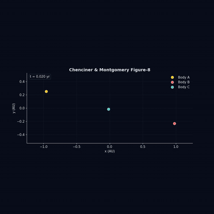
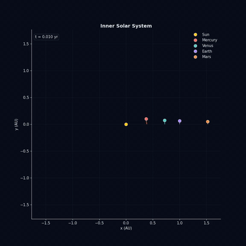
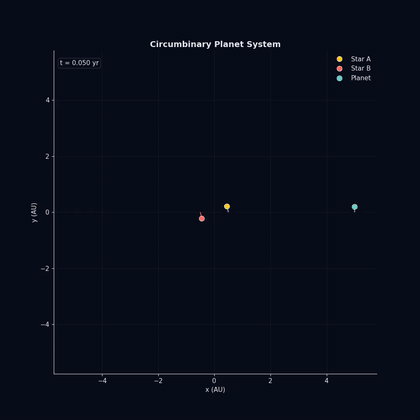

# N-Body Gravitational Simulator

A C++ N-body simulator using fourth-order Runge-Kutta integration, with a
Python/Matplotlib visualization package that produces static plots and
animated MP4/GIFs of the resulting trajectories.

Three pre-built scenarios are included; the simulator is config-driven
(JSON), so adding new ones is just a new file.

**Platforms:** Linux · macOS · Windows (validated on Ubuntu 24.04 and
Windows 11 with MSYS2 / MinGW-w64).

<p align="center">
  
</p>

## Gallery

| Solar System | Figure-8 Three-Body | Binary + Planet |
|:---:|:---:|:---:|
|  |  |  |
| 5 bodies, 5 years | 3 bodies, 12.65 years | 3 bodies, 20 years |
| ΔE/E ≈ 2.7×10⁻⁹ | ΔE/E ≈ 1.2×10⁻¹⁴ | ΔE/E ≈ 2.7×10⁻¹⁰ |
| [full MP4](output/solar/animation.mp4) | [full MP4](output/three_body/animation.mp4) | [full MP4](output/binary/animation.mp4) |

## Physics

Each body's acceleration comes from Newton's law of universal gravitation
summed over every other body:

$$\vec{a}_i \;=\; \sum_{j \neq i} G \, m_j \, \frac{\vec{r}_j - \vec{r}_i}{\left( \left| \vec{r}_j - \vec{r}_i \right|^2 + \epsilon^2 \right)^{3/2}}$$

Plummer softening ($\epsilon$) is optional — set to 0 for the solar system,
non-zero only if you want to guard against pathological near-collisions.

Internal units: AU, solar masses, years. In these units $G = 4\pi^2$, which
follows from Earth ($\approx 0$ mass at $1$ AU) orbiting the Sun ($1\,M_\odot$)
once per year at $v = 2\pi$ AU/yr.

The integrator is fixed-step RK4 with $\mathcal{O}(\Delta t^4)$ global accuracy.
It is not symplectic, so total energy drifts slowly, but on the order of
$10^{-9}$ over a five-year solar-system simulation. The `energy.png` diagnostic
plots this directly.

## Build

The project ships with two equivalent build systems — pick whichever you
prefer. Both produce a binary called `nbody` (or `nbody.exe` on Windows).

### Option A: Make (Linux / macOS / WSL)

```
make
```

Auto-fetches `nlohmann/json.hpp` on first build if it's missing.

Requires: g++ with C++20, GNU make, curl OR git.

### Option B: CMake (cross-platform; recommended on Windows)

```
cmake -S . -B build
cmake --build build
```

The binary lands at `build/nbody`. On Windows, you can also just open the
project folder in Visual Studio 2022 — it speaks CMake natively (`File →
Open → CMake...`). VS Code with the CMake Tools extension also works.

CMake also auto-fetches `json.hpp` on configure if it's missing.

Requires: CMake ≥ 3.15 plus a C++20 compiler (g++, clang++, or MSVC).

### Option C: One-liner (no build system at all)

```
g++ -std=c++20 -O2 -Isrc -Ithird_party src/*.cpp -o nbody
```

## Run

```
./nbody scenarios/solar_system.json output/solar
./nbody scenarios/three_body.json output/three_body
./nbody scenarios/binary_planet.json output/binary
```

Writes `trajectory.csv` and `energy.csv` to the output directory.

> **Windows (PowerShell):** the binary is `.\build\nbody.exe` (or
> `.\build\Release\nbody.exe` if you built with Visual Studio). Use
> backslashes in paths.

## Visualize

```
python3 -m viz output/solar      --title "Inner Solar System"
python3 -m viz output/three_body --title "Chenciner & Montgomery Figure-8"
python3 -m viz output/binary     --title "Circumbinary Planet System"
```

Outputs in the same directory:

- `trajectory.png`     — full orbital paths
- `velocity_field.png` — velocity vectors along each orbit
- `energy.png`         — log-scale energy drift over time
- `animation.mp4`      — animated orbits with fading trails

CLI options:
- `--gif`       use Pillow to write a GIF instead of an MP4 (no ffmpeg needed)
- `--no-anim`   skip the animation (much faster for iteration)
- `--fps N`     animation frame rate (default 30)
- `--trail N`   length of fading trail in frames (default 120)

Requires: matplotlib, pandas, pillow. For MP4: ffmpeg on PATH.

> **Windows:** use `python` instead of `python3` — the standard installer
> only registers `python.exe`, and `python3` triggers the Microsoft Store
> install prompt.

## Project layout

```
nbody/
├── Makefile                    Linux/macOS build
├── CMakeLists.txt              cross-platform build (used on Windows)
├── src/
│   ├── Vec3.hpp                3D vector arithmetic
│   ├── Body.hpp                body data (name, mass, position, velocity)
│   ├── System.hpp/.cpp         pairwise gravity + energy diagnostic
│   ├── Integrator.hpp/.cpp     RK4 stepping (functional style)
│   ├── Config.hpp/.cpp         JSON scenario loader
│   └── main.cpp                CLI / simulation loop / CSV output
├── scenarios/
│   ├── solar_system.json       Sun + Mercury, Venus, Earth, Mars
│   ├── three_body.json         Chenciner-Montgomery figure-8 (G=1, m=1)
│   └── binary_planet.json      equal-mass binary + circumbinary planet
├── viz/
│   ├── __init__.py             package exports
│   ├── __main__.py             CLI (python -m viz)
│   ├── style.py                dark theme + color palette
│   ├── data.py                 CSV loading
│   ├── trajectory.py           static orbital paths
│   ├── velocity.py             velocity quiver field
│   ├── energy.py               energy drift over time
│   └── animation.py            animated MP4/GIF with fading trails
├── docs/preview/               small GIFs used in this README
└── third_party/nlohmann/json.hpp
```

## Adding a scenario

Drop a new JSON file in `scenarios/`. Required keys: `name`, `dt`,
`total_time`, `output_dt`, and a non-empty `bodies` array. Each body
needs `name`, `mass`, `position` (array of 3), `velocity` (array of 3).
Optional top-level keys: `G` (defaults to $4\pi^2$), `epsilon` (defaults
to 0). See the existing scenario files for examples.

## Validating that it works

A throwaway sanity-check is included in `test_orbit.cpp`. It simulates
Earth orbiting the Sun for one year and reports the final position error
(expected $\sim 10^{-5}$ AU) and energy drift (expected $\sim 10^{-12}$). To run:

```
g++ -std=c++20 -O2 -Isrc test_orbit.cpp src/System.cpp src/Integrator.cpp -o test_orbit
./test_orbit
```

## Regenerating the README preview GIFs

The previews in `docs/preview/` are small (~500 KB each) so they render
inline on GitHub. To regenerate them after changing a scenario:

```
ffmpeg -y -i output/solar/animation.mp4 \
  -vf "fps=12,scale=420:-1:flags=lanczos,split[s0][s1];[s0]palettegen=max_colors=128[p];[s1][p]paletteuse=dither=bayer:bayer_scale=5" \
  -loop 0 docs/preview/solar.gif
```

(Repeat for `three_body` and `binary`.) The split/palettegen/paletteuse
trick gives much smaller, cleaner GIFs than a naive conversion.

---

## License

**MIT** — see [`LICENSE`](./LICENSE).

You are free to view, fork, modify, and use this code for any purpose,
including commercial. Attribution is appreciated but not required. If you
build something interesting on top of it, I'd love to hear about it via my
[GitHub profile](https://github.com/Jamil-M03).